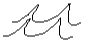

# 955 - Login to System

Users use this function to securely enter the system. Users do so by
providing their credentials. Upon verification, the system provides users
with access to the functions for which they are authorized.

Upon consecutive failed logins within a time period (i.e. one hour), the
system will lock the user's account for a set time (i.e. one hour) to
prevent their account from being compromised, AND inform the system's
administrators of the lock.

## Primary Actor

All users

## Precondition(s)

- User is *not* logged in to the system.

## Main Success Scenario

1. User decides to use the system.
2. System asks user for their username and password.
3. User provides their credentials.
4. System verifies user's credentials.
5. System provides access to functions for which user is authorized.
6. System logs the login, username, IP address, and time.

## Extensions

4a. Account dormant (turned-off):

  1. System informs user that their credentials are invalid.
  2. System logs the failure, username, IP address, and time.

4b. Account locked:

  1. System informs user that their account is locked.
  2. System logs the attempt, username, IP address, and time.

4c. Bad password provided:

  1. System informs user that the login attempt failed.
  2. System logs the failure, username, IP address, and time.

4d. Too many consecutive password failures within time period:

  1. System informs user that the login attempt failed.
  2. System locks user's account for a set time period.
  3. System emails administrators of the lock.
  4. System logs the lock, username, IP address, and time.

5a. Password marked for reset:

  1. See __change password__.

## Technology & Data Variations List

- `DENY_THRESHOLD_VALID` - Number of consecutive failed logins that triggers
  the account being locked.
- `AGE_RESET_VALID` - Number of minutes to wait after the last failed login
  attempt to reset the count of failures to zero.

## Related Information

- See the [DenyHosts][1] utility for the inspiration behind the deny
  threshold and age reset functionality.

[1]: http://denyhosts.sourceforge.net/
